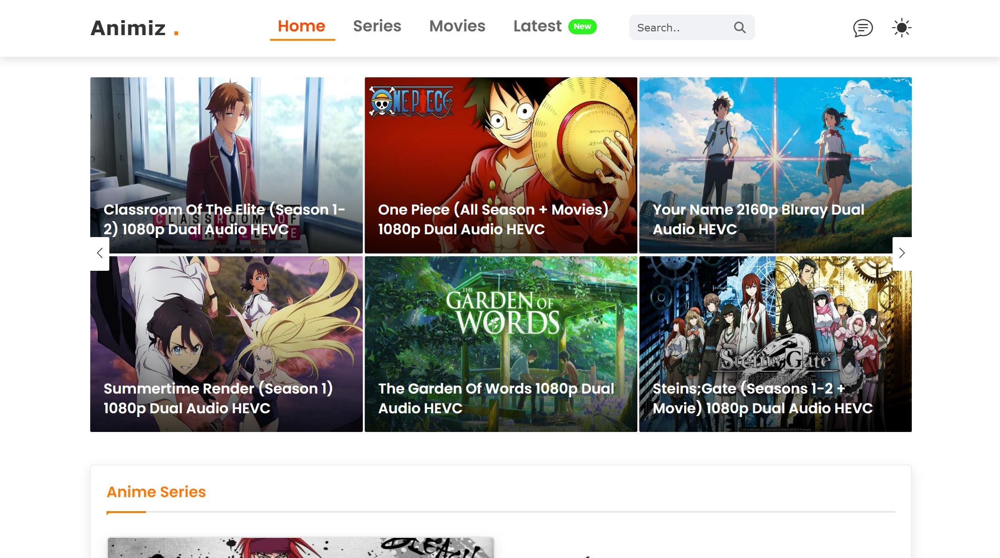

# Animiz 👒

🌟Welcome to the Highly Responsive Anime Website project! This project is a sleek and modern website dedicated to anime content, featuring a highly responsive design with dark/light mode switch and a working feedback form.🌟

## 🕶 Preview



## 📝 Overview

This website offers anime enthusiasts a visually appealing and user-friendly platform to explore their favorite anime series, movies, characters, and more. With its responsive design and dark/light mode switch, users can enjoy an optimized viewing experience across various devices and preferences.

## 💎 Key Features

- **Responsive Design**: Enjoy a seamless browsing experience on desktops, tablets, and mobile devices, ensuring content is accessible and visually appealing across all screen sizes.
- **Dark/Light Mode Switch**: Toggle between dark and light mode to suit your viewing preferences and reduce eye strain during nighttime browsing.
- **Anime Catalog**: Browse through a curated catalog of anime series and movies with detailed descriptions, images, and ratings.
- **Feedback Form**: Engage with the website by providing feedback, suggestions, or inquiries through the integrated feedback form.
- **Sleek Design**: Experience a modern and visually stunning design with carefully crafted UI elements and animations.

## 🛠️ Technologies Used

- **HTML5**: Structure the content of the website.
- **CSS3**: Style the layout and design elements, including dark/light mode styling.
- **JavaScript**: Implement dynamic functionality, including the dark/light mode switch and feedback form validation.

## 🚀 Getting Started

To explore the website or contribute to the project, follow these steps:

1. Clone the repository:
   ```bash
   git clone https://github.com/Nikhilgholap1304/Animiz.git
   
2. Open the project directory in your code editor.

3. Launch the index.html file in your web browser to view the website.

## 🤝 Contributing   

Contributions to enhance the website's features or fix issues are welcome! If you'd like to contribute, please follow these steps:

1. Fork the repository.

2. Create a new branch for your feature or bug fix:
   ```bash
   git checkout -b feature-name
3. Make your changes and commit them:
   ```bash
   git commit -m "Add feature or fix"
4. Push your changes to your fork:
   ```bash
   git push origin feature-name
5. Create a pull request on the original repository.

## 📄 License

Check out the license ✒ [License](LICENSE.txt)
